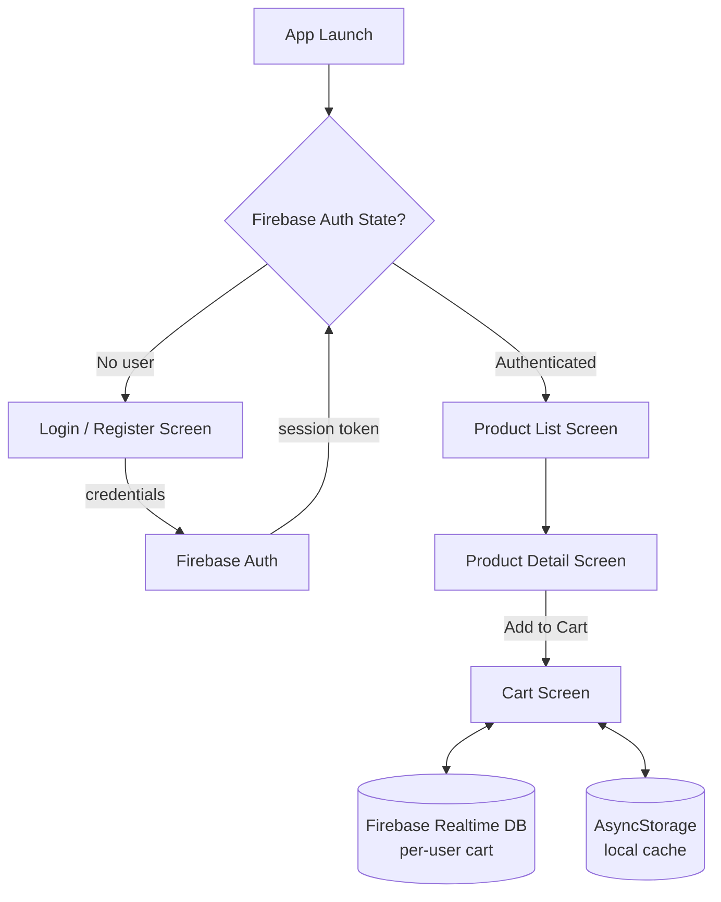

# React Native Firebase E-Commerce Cart App


> Originally built as a semester practical assessment ("Test 2"). Renamed to reflect what it actually is: a mobile e-commerce cart flow with Firebase-backed auth and a realtime, per-user shopping cart.

## Executive Summary

A cross-platform (iOS/Android/Web) mobile storefront demo that solves the core problem every shopping app faces: **let a user authenticate, browse a product catalog, and maintain a cart that survives app restarts and syncs to the cloud.** It demonstrates a full authenticated-vs-unauthenticated navigation split, realtime data sync, and offline-friendly local caching — the same architectural shape used in production retail apps, just scaled down to a lab exercise.

## Key Architectural Features

- **Auth-gated navigation** — a single `NavigationContainer` swaps its entire screen stack based on Firebase auth state (`onAuthStateChanged`), so unauthenticated users only ever see Login/Register, never the store.
- **Realtime Database cart sync** — cart state is persisted per-user in Firebase Realtime Database, so it's available across devices/sessions, not just in memory.
- **Offline-first caching** — `AsyncStorage` mirrors cart state locally so the cart still works with no network connection.
- **Environment-based secrets** — Firebase config is now read from `EXPO_PUBLIC_*` environment variables (previously hardcoded — see Security Notes) instead of being committed to source control.
- **Stack navigation with conditional routing** — `Products → Product Detail → Cart` flow using `@react-navigation/native-stack`.

## Tech Stack

| Layer | Technology |
|---|---|
| Language | JavaScript (ES6+) |
| UI Framework | React Native 0.81 + React 19 (via Expo SDK 54) |
| Navigation | React Navigation (native-stack, bottom-tabs) |
| Auth | Firebase Authentication |
| Database | Firebase Realtime Database |
| Local Storage | `@react-native-async-storage/async-storage` |
| Tooling | Expo CLI, Metro bundler |

## System / Data Flow



## Getting Started & Local Setup

**Prerequisites:** Node.js 18+, npm, the [Expo Go](https://expo.dev/go) app (or an Android/iOS simulator), and a Firebase project with Authentication + Realtime Database enabled.

1. Clone and install dependencies:
   ```bash
   git clone https://github.com/MzooNgubane/react-native-firebase-ecommerce-app.git
   cd react-native-firebase-ecommerce-app
   npm install
   ```
2. Configure environment variables:
   ```bash
   cp .env.example .env
   # then fill in .env with your Firebase project's SDK config values
   ```
3. Start the dev server:
   ```bash
   npx expo start
   ```
4. Scan the QR code with Expo Go, or press `a` / `i` for an Android/iOS simulator.

## Testing & Validation

This project does not yet ship an automated test suite. To validate the codebase:

```bash
npx expo start        # boots Metro and surfaces bundling/syntax errors immediately
```

Manual QA checklist: register a new account → confirm redirect to Product List → add an item to cart → force-quit the app → relaunch → confirm the cart persisted (Realtime DB + AsyncStorage).

## Security Notes

The Firebase Web SDK config was previously hardcoded in `Firebase.js` and committed to git history. It has been moved to environment variables (`.env`, gitignored) with `.env.example` as the template. Firebase client keys are not inherently secret, but access control should still be enforced server-side via [Firebase Security Rules](https://firebase.google.com/docs/database/security) rather than relying on key secrecy.
